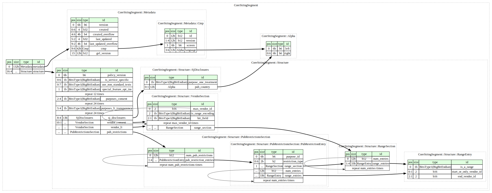
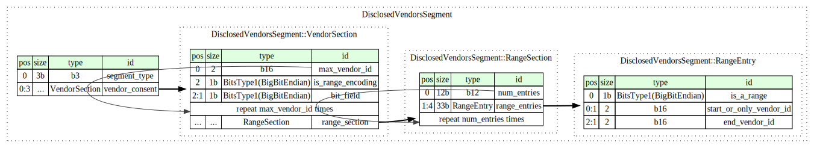

# YACONSTRIP - Yet Another CONsent STRIng Parser

Universal Consent String Parsing


Q:What?
A: IAB TCF Consent String Parser, yeah... another one, but it works, in multiple languages.

## Visual representation of the TC String
TC String structure: `[CORE].[DISCLOSED_VENDORS].[PUBLISHER_RESTRICTIONS]`

### Core:




### Disclosed Vendors:



### Publisher Purposes Transparency and Consent:


## Key Features 🎯
- **One ring... to rule them all**: One code, many languages:
    - C++/STL
    - C#
    - Go 
    - Java
    - JavaScript
    - Lua
    - Nim 
    - Perl
    - PHP
    - Python
    - Ruby
- **Easy to maintain**: IAB updated their guidelines? No problem, update the _.ksy_ definition files then use the compiler to re-build the modules.


## Roadmap 🎯
- Add more examples

## Getting Started 🚀

Follow these instructions to get a copy of the project up and running on your local machine for development and testing purposes.

### Prerequisites 📋

Ensure you have the following installed:
- [Kaitai Struct Compiler](https://kaitai.io/#download)

Optionally, you might want the [Kaitai Struct Visualizer](https://github.com/kaitai-io/kaitai_struct_visualizer)

### Installation Steps 💽

Step 1: Clone this repository:

```bash
git clone https://github.com/angulartist/yaconstrip.git && cd yaconstrip
```

Step 2: Import the modules you want from `modules/`

### Compile the .ksy files

```bash
# language specific
kaitai-struct-compiler --outdir [path/to/output/dir] -t [language] [path/to/.ksy/files]

# example (compile .ksy for Javascript)
kaitai-struct-compiler --outdir examples/javascript/compiled_ksy -t javascript kaitai/*

# or, build modules for all supported languages
./compile-all.sh
```

## Examples ✨

You can find some inspirations in the [examples](examples/) folder.

## Contributors ✨

Thanks go to these wonderful people:
<a href="https://github.com/angulartist/yaconstrip/graphs/contributors">
  
</a>

## Contribute 🤝

Got a pull request? Open it, and we'll review it as soon as possible.

- [Open Issues](https://github.com/angulartist/yaconstrip/issues)
- [Open Pull Requests](https://github.com/angulartist/yaconstrip/pulls)

## Resources 📋

- IAB TCF DOC : [Official IAB TCF Consent String Documentation](https://github.com/InteractiveAdvertisingBureau/GDPR-Transparency-and-Consent-Framework/blob/master/TCFv2/IAB%20Tech%20Lab%20-%20Consent%20string%20and%20vendor%20list%20formats%20v2.md)
- About Kaitai Struct : https://kaitai.io/