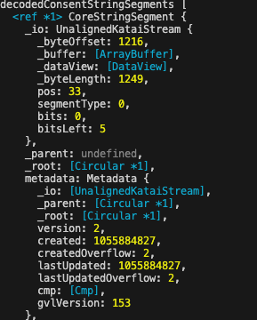

## Examples in Javascript

The compiled .ksy files to Javascript are located in the [compiled-ksy folder](compiled_ksy)

[decoder.js](decoder.js) describes how to parse the TC String segments into bit streams.

### Demo

```javascript
node index.js
```

#### Output
